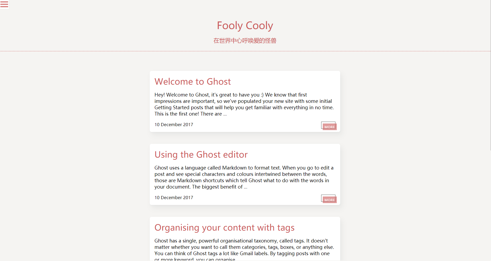
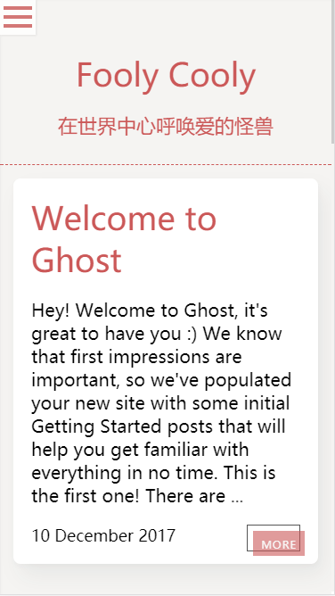

Simplify
========

Simplify是个发布在Ghost博客平台的主题，集轻量和简约于一体

并且它是 **免费的**， 喜欢的话欢迎star✨，谢谢

这里有个[demo](https://daily.enzbill.com)





### 特性

-	基于prism.js的代码高亮
-	支持Disqus等评论平台
-	响应式布局，移动端友好
-	去图片化

怎么安装
--------

在github的release页面里， 下载"simplify.zip"并在你的网站后台中进行上传。 不建议直接下载本仓库，因为仓库里有些额外的文件， 比如预览图

使用评论系统
------------

你可以使用像Disqus之类的评论系统， 找到simplify/post.hbs， 可以找到如下的代码结构

```html
<div class="container">
    {{content}}
</div>
```

在"{{content}}"后把评论系统给你的代码插进去， 就像这样

```html
<div class="container">
    {{content}}
    <div class=""></div>
    <script></script>
</div>
```

### 需要帮助？

开issue吧
