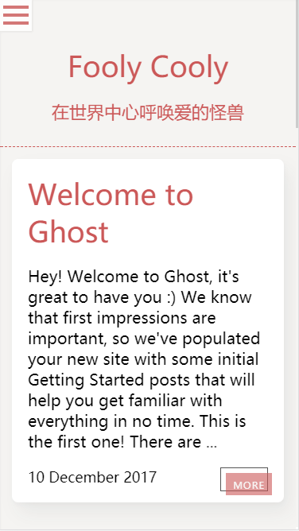

Simplify
========

[中文翻译/chinese translate](./README-zh.md)

Simplify is a light and simple theme published for Ghost blog platform.

And it's for **free**, i'm also appreciated for your **star**✨ if you like it

There is a [demo](https://daily.enzbill.com) for you




### Feature

-	Code Highlight powered by prism.js
-	Support comment system such as disqus
-	responsive layout and mobile friendly styles
-	No images, just keep everything simple

How to install it?
------------------

In the github release page, you'll see the "simplify.zip". Download it and upload it in your ghost admin. I'm not suggest that download this repo directly because this repo has some extra file, such as the preview image.

Using comment platform
----------------------

You can use comment platform such as disqus. Go to simplify/post.hbs you'll see the code structure like this

```html
<div class="container">
    {{content}}
</div>
```

Just insert the code which disqus gived you after the "{{content}}" For example, like this

```html
<div class="container">
    {{content}}
    <div class=""></div>
    <script></script>
</div>
```

### Need for help?

you can open a issue
